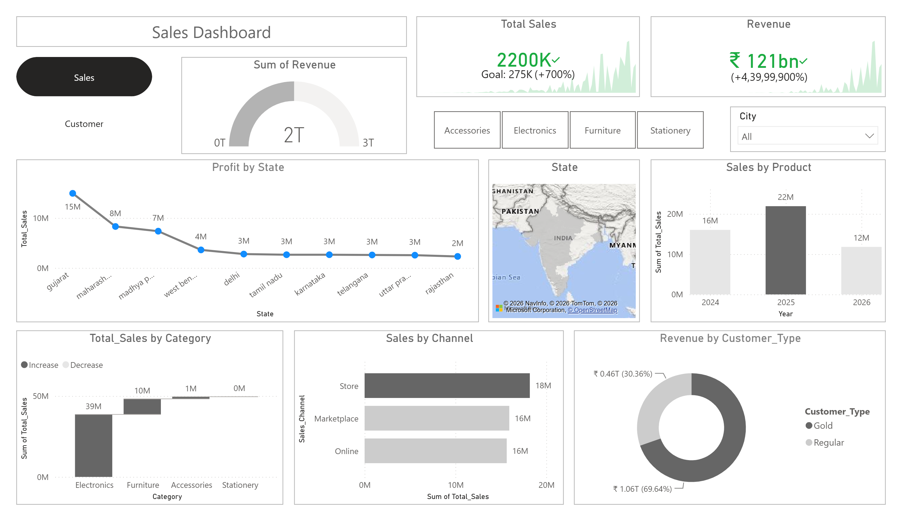
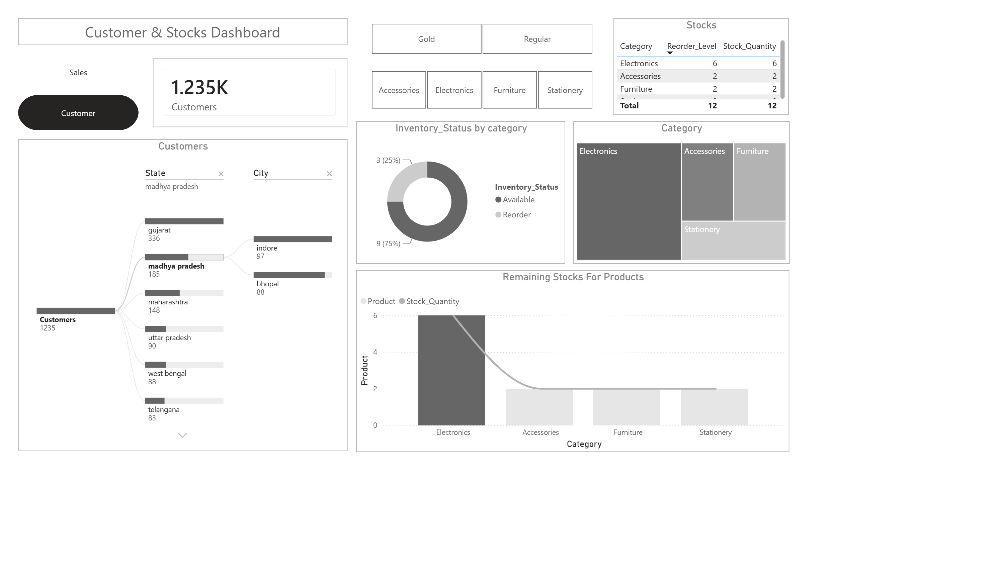

# Business Sales & Customer Analytics

> **Industry-level Data Analytics Project | • Python (Pandas,NumPy) • Power BI **

## 📌 Project Overview

This project demonstrates an end-to-end **business analytics workflow** using a deliberately messy sales dataset. The objective is to convert raw transactional, customer, and product-master data into a reliable analytical dataset and actionable business insights.

### Source Data

| Dataset | Records | Business Purpose |
|---|---:|---|
| Sales Transactions | 1,235 | Transaction-level sales and order analysis |
| Customer Master | 684 | Customer profile and segmentation |
| Product Master | 12 | Product pricing, supplier and inventory analysis |

---

## 🎯 Business Problem

The business has sales, customer, and product data stored across operational datasets, but the raw data contains quality issues that can make reporting unreliable.

The analytical problem is to answer:

1. **How much revenue is the business generating?**
2. **Which products and categories drive revenue?**
3. **Which states and sales channels contribute most?**
4. **What is the order/payment status distribution?**
5. **Which products require inventory replenishment?**
6. **Where are the major data-quality risks?**
7. **What decisions should management take based on the analysis?**

---

## 🛠️ Technology Stack

| Area | Tools |
|---|---|
| Data Cleaning | Python, Pandas, NumPy |
| Dashboarding | Power BI |
| Version Control | GitHub |

---

## 📊 Power BI Dashboard

---

# 🧹 1. Data Cleaning

The cleaning workflow standardizes the raw business data before analysis.

### Sales Data

The project performs:

- Customer ID sorting
- Customer-name whitespace removal
- Email standardization
- Missing email handling
- Missing phone handling
- City/state standardization
- Negative quantity correction using absolute values
- Numeric conversion for quantity, unit price and sales
- Missing unit-price handling

### Customer Master

The project performs:

- Customer ID sorting
- Customer-name cleaning
- Email standardization
- Phone missing-value handling
- City/state standardization
- Registration-date conversion
- Column-name standardization

### Product Master

The project converts:

- Standard price → numeric
- Reorder level → integer
- Stock quantity → integer

The cleaning logic is implemented in `clean.py`.

---

# 📊 2. Data Quality Findings

The raw dataset intentionally contains several real-world data-quality problems.

| Issue | Finding |
|---|---:|
| Missing Emails | 73 |
| Missing Phones | 46 |
| Missing Unit Prices | 25 |
| Exact Duplicate Rows | 34 |
| Duplicate Customer + Product + Date combinations | 35 |
| Inconsistent Order Status formatting | Yes |
| Inconsistent Payment Status formatting | Yes |
| Negative quantity values | Present in raw data |
| Mixed date formatting | Present in raw data |

### Key Data Quality Risk

A duplicate-looking `Customer_ID + Product + Order_Date` combination should **not** automatically be deleted without a transaction identifier. It may represent a legitimate repeated purchase.

**Production recommendation:** introduce a unique `Order_ID` / `Transaction_ID`.

---

---

# 🔎 4. Business Insights

## 4.1 Category Performance

**Electronics** is the dominant revenue category, generating approximately **₹36,993,200**, or **78.2% of calculated revenue**.

| Category | Revenue | Quantity | Transactions |
|---|---:|---:|---:|
| Electronics | ₹36,993,200 | 2,645 | 613 |
| Furniture | ₹8,895,000 | 876 | 200 |
| Accessories | ₹1,244,700 | 942 | 215 |
| Stationery | ₹164,590 | 883 | 207 |

### Insight

The business is highly dependent on the **Electronics** category. This creates both an opportunity and a concentration risk.

**Recommended actions:**
- Protect availability of high-performing products.
- Monitor category-level demand and pricing.
- Prioritize high-value SKUs for inventory planning.
- Evaluate diversification opportunities in weaker categories.

---

## 4.2 Product Performance

The leading product by calculated revenue is **Laptop**, contributing approximately **₹19,250,000 (40.7%)** of revenue.

| Rank | Product | Revenue |
|---:|---|---:|
| 1 | Laptop | ₹19,250,000 |
| 2 | Smartphone | ₹9,744,000 |
| 3 | Monitor | ₹5,760,000 |
| 4 | Desk | ₹5,376,000 |
| 5 | Office Chair | ₹3,519,000 |

### Insight

High-value products have a disproportionate effect on total revenue. Inventory availability, pricing and promotion should therefore prioritize products such as **Laptop**.

---

## 4.3 Geographic Performance

**Gujarat** is the strongest state in the dataset, generating approximately **₹13,869,170**.

| Rank | State | Revenue | Transactions | Customers |
|---:|---|---:|---:|---:|
| 1 | Gujarat | ₹13,869,170 | 330 | 268 |
| 2 | Maharashtra | ₹7,826,450 | 143 | 129 |
| 3 | Madhya Pradesh | ₹6,468,350 | 180 | 165 |
| 4 | West Bengal | ₹3,125,740 | 86 | 80 |
| 5 | Delhi | ₹2,637,380 | 74 | 71 |

### Insight

The strongest markets should receive focused retention, availability and expansion strategies. Lower-performing markets should be evaluated for acquisition potential rather than receiving identical investment.

---

## 4.4 Sales Channel Performance

| Channel | Revenue | Transactions | Quantity |
|---|---:|---:|---:|
| Store | ₹17,539,370 | 411 | 1,771 |
| Marketplace | ₹15,325,680 | 389 | 1,681 |
| Online | ₹14,432,440 | 435 | 1,894 |

### Insight

**Store** is the leading channel by calculated revenue.

Channel performance should ultimately be evaluated using revenue plus:

- Average transaction value
- Return/cancellation rate
- Customer acquisition cost
- Contribution margin
- Payment success rate

Revenue alone does not establish channel profitability.

---

## 4.5 Order & Payment Health

### Order Status

| Status | Transactions |
|---|---:|
| Cancelled | 266 |
| Processing | 263 |
| Shipped | 244 |
| Returned | 243 |
| Delivered | 219 |

### Payment Status

| Status | Transactions |
|---|---:|
| Pending | 320 |
| Paid | 312 |
| Refunded | 310 |
| Cancelled | 293 |

### Insight

The dataset contains meaningful operational exposure across **cancelled, returned, processing and shipped transactions**.

A production dashboard should monitor:

- Return Rate
- Cancellation Rate
- Payment Success Rate
- Delivery Rate
- Refund Rate
- Average Fulfillment Time

These metrics should be segmented by product, geography and channel to identify the root causes of revenue leakage.

---

# 📦 5. Inventory Insights

The product master identifies the following SKUs at or below their reorder level:

**{reorder_products}**

| Product | Current Stock | Reorder Level |
|---|---:|---:|
| Smartphone | 95 | 100 |
| Pen Set | 3 | 100 |
| Backpack | 15 | 100 |

### Business Recommendation

These products should be prioritized for replenishment review.

However, reorder level alone should not determine purchase quantity. A production inventory model should also consider:

- Historical sales velocity
- Supplier lead time
- Safety stock
- Seasonality
- Supplier reliability
- Forecasted demand

---

# 👥 6. Customer Analysis

The customer master contains **{len(cust):,} customers** across four customer types.

| Customer Type | Customers |
|---|---:|
| VIP | 195 |
| Regular | 165 |
| New | 163 |
| Premium | 161 | 
